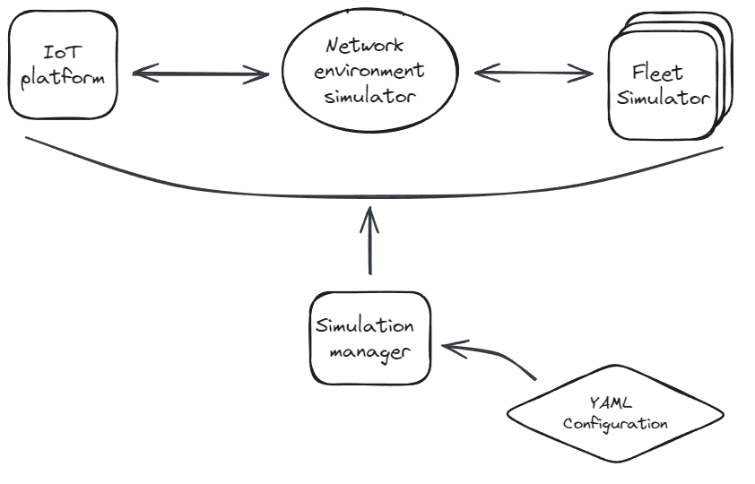
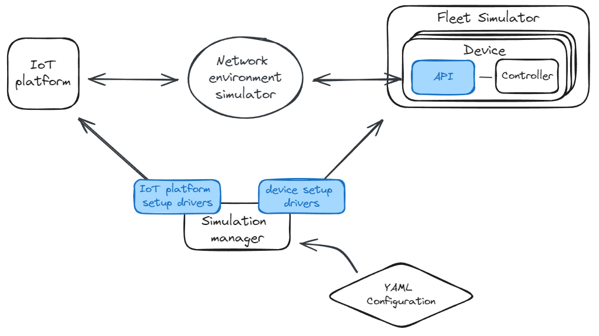

# IoT Platform and Fleet Management Simulation

This repository contains a project for the simulation and testing of IoT platforms and Fleet management systems. The goal is to provide an easy-to-use framework capable of integrating a wide range of platforms. We implement configurable test environments composed of lightweight simulated devices and network environment simulation.

We name the framework FIST - Fleet sImulator for Scalability Tests.



## Project structure

The project is composed of the following elements:

- `Scalability Tools` folder: Implements all the components needed to run a simulation.
- `Codes` folder: Contains platform-specific scripts and how the simulator should use these scripts.
- `Data` folder: A placeholder for all the results of a simulation.

Inside of the codebase we provide README files related to the main elements. For a more detailed explaination of specific elements, look at the corresponding file. Here you can find a list of files:
- [codes/README.md](codes/README.md)
- [scalability-tools/README.md](scalability-tools/README.md)
  - [scalability-tools/client/README.md](scalability-tools/client/README.md)
    - [scalability-tools/client/examples/README.md](scalability-tools/client/examples/README.md)
  - [scalability-tools/docker-tc-patch/README.md](scalability-tools/docker-tc-patch/README.md)
  - [scalability-tools/examples/README.md](scalability-tools/examples/README.md)
  - [scalability-tools/explore/README.md](scalability-tools/explore/README.md)
  - [scalability-tools/simulator/README.md](scalability-tools/simulator/README.md)

## Requirements

- The Fleet Simulator is implemented in **Go**, version go1.21.2 linux/amd64.
- The Simulation Manager is implemented in **Python**, version Python 3.10.12.
- The Fleet Simulator, Network Environment Simulator and the IoT platform are **dockerized**, Docker version 24.0.7, build afdd53b.
- The Network Environment Simulation uses an open-source project named **docker-tc**.
- We use yq v4.35.2 to process yaml configurations in bash (https://github.com/mikefarah/yq/releases/tag/v4.35.2)

## How to add a new platform

We do not assume anything about the IoT platform and how devices should connect to it or execute the desired tasks. For this reason, to integrate new platforms and run tests, it is required to provide implementations for:

- **IoT platform lifecycle handling**: How to start, stop a platform, how to trigger a task, and how to clean up the environment for future tests.
- **Devices behavior**: How to create, start, connect a device.
- **Specific simulation scenarios**: How to configure a simulation using your provided implementations.

Most importantly, given a desired IoT platform, different elements must be implemented to allow the integration of this simulator with the target platform. Specifically, the missing elements are:
- a device implementation in the client subproject (for more details have a look at [this README](client/examples/README.md))
- an IoT platform interface in the simulator subproject (for mode details have a look at [this README](simulator/src/fistsim/server/examples/README.md)). 
- a simulation configuration that provides all the required config and test scenario variables (for mode details have a look at [this README](simulator/examples/README.md)).



<!-- Steps:
- gather IoT platform configurations and setup scripts 
    - put them in the [codes](scalability-report/codes) folder

- implement FIST IoT platform specific handlers 
    - the structure of an handler must follow the implementation of [ServerHandler](scalability-report/scalability-tools/simulator/src/fistsim/server/base.py)

- implement FIST device simulator behavior
    - most of a device implementation is provided in the [client golang subproject](scalability-report/scalability-tools/client)
    - it's needed to add a device specific behavior matching the IoT platform task you want to test
        - add your implementation in /scalability-report/scalability-tools/client/examples
        - the implementation should follow the [DeviceFactory](scalability-report/scalability-tools/client/templates/Device.go) implementation

- implement devices handler configuration in case some specific 

- setup a config yaml where to put simulation specific values
    - this yaml will be used by the developed IoT platform handler and device simulator

You are now ready to run a simulation scenario. -->

## Installation and setup

Before running a simulation, a serie of steps must be followed:
1. implement platform specific code following the instructions provided in the [How to add a new platform](#how-to-add-a-new-platform) Section
2. build the docker-tc network simulator and apply the provided patch
3. build the Fleet Manager golang project
4. build the Python simulator package
5. define a yaml configuration for your specific needs

There are 2 options to run a simulation using the yaml file:
- using the following python command
```
cd scalability-report/scalability-tools/simulator
python3 simulator.py --configFile <path_to_config_file>
```
- implement a bash script following one of the examples provided in this [autotest.sh](scalability-tools/scripts/autotests/autotest.sh) script.


## Usage examples

We focused on two open-source platforms: 
- [Thingsboard](https://github.com/thingsboard/thingsboard) 
- [Eclipse Hawkbit](https://github.com/eclipse/hawkbit)

Running tests on them and dive deep into their servers and simulators design logics.

A container-based fleet simulator is delivered for better simulations. It is able to work with different fleet management platforms to simulate device auto-provisioning and OTA updates. It also offers the configurable simulations on network conditions, device-side failure and delays. See details at [link](scalability-tools)
